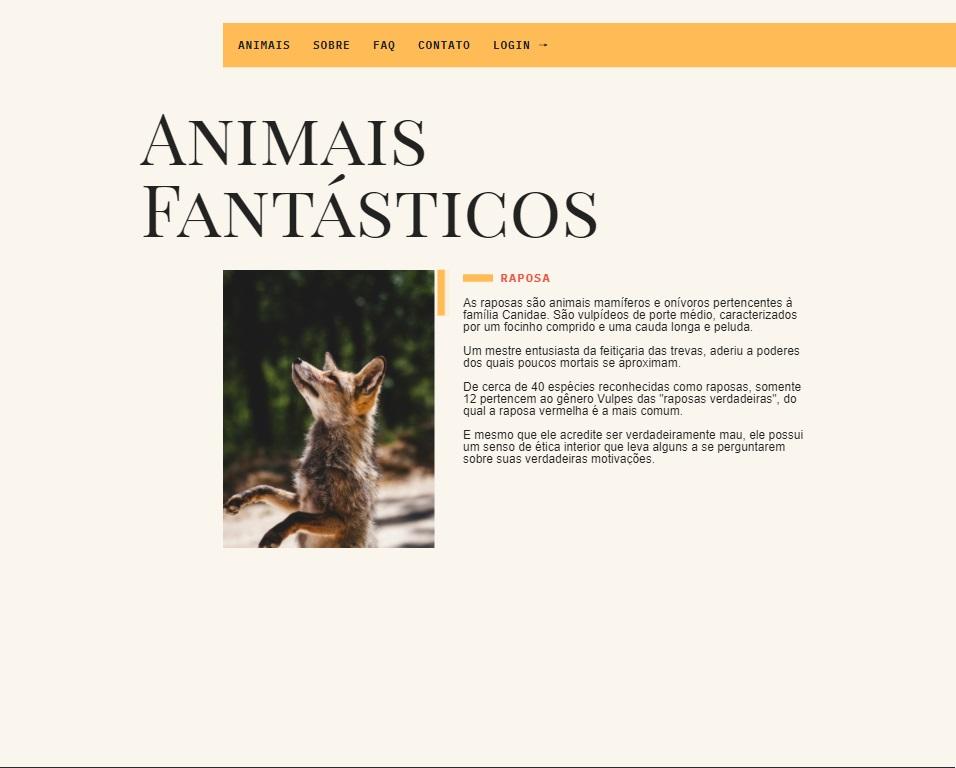
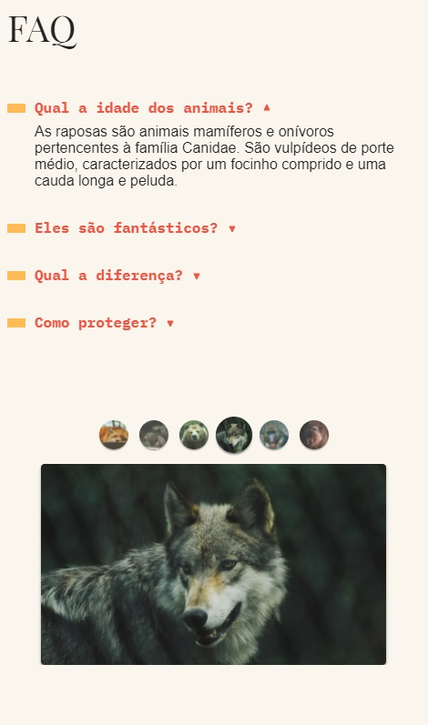

<h1>Animais Fantásticos - Portal</h1>

O projeto foi desenvolvido para estudar HTML, CSS, JS e aprender a usar Bash/GitHub.

 
 

**Inicio - Desktop**

<table>
  <th colspan="4">Lista dos animais</th>
<tr>
<td>
  
</td>
<td>
  
</td>
<td>
  
</td>
<td>
  
</td>
</tr>
</table>

**Seções**

<table>
<th>FAQ</th>
<th>Números</th>
<th>Contato</th>
<tr>
<td>
  
</td>
<td>
  
</td>
<td>
  
</td>
</tr>
</table>

 
 

**Início - Mobile**

<table>
  <th colspan="4">Lista e Menu Dropdown </th>
<tr>
<td>
  
</td>
<td>
  
</td>
<td>
   
</td>
<td>
   
</td>
</tr>
</table>

**Seções**

<table>
<th>FAQ</th>
<th>Números</th>
<th>Contato</th>
<tr>
<td>
  
</td>
<td>
  
</td>
<td>
  
</td>
<td>
  
</td>
</tr>
</table>

<h2>Getting Started</h2>
<pre>
<code>-git clone https://github.com/SetropLeo/Animais-Fantasticos
</code>
</pre>

<h2>Tecnologias utilizadas</h2>
<ul>
<li>HTML5</li>
<li>CSS3</li>
<li>JavaScript</li>
</ul>

<h2>Contributions</h2>
<a href="W3CSchools">https://w3schools.com/</a> 
 
<a href="Origamid - JS ES6+">https://origamid.com.br/</a>
